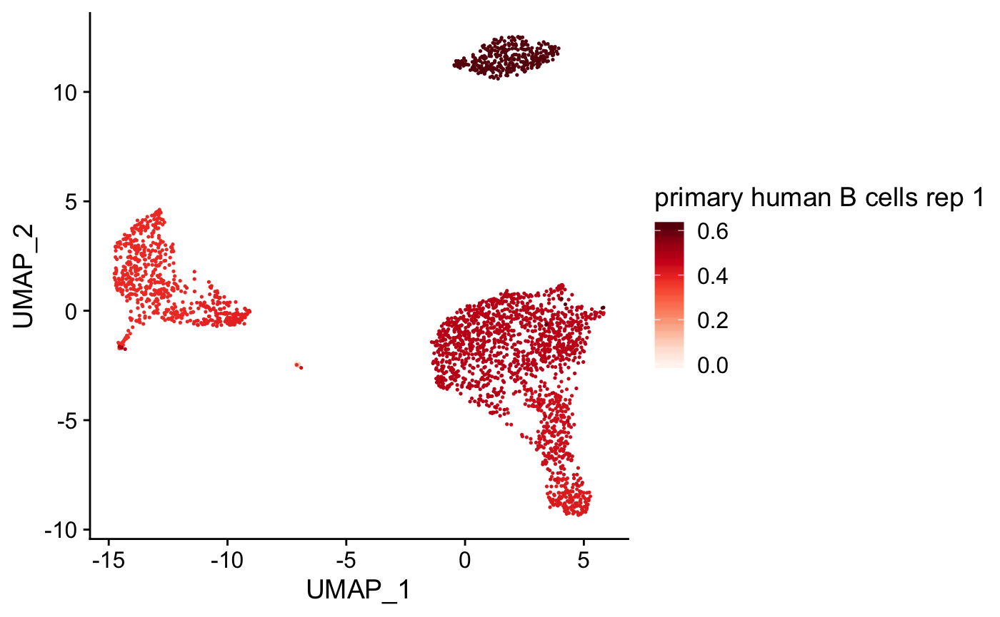

# clustifyr 

<!-- badges: start -->

[](https://github.com/rnabioco/clustifyr/actions)
[](https://codecov.io/gh/rnabioco/clustifyr)
[](https://bioconductor.org/packages/release/bioc/html/clustifyr.html)
[](https://bioconductor.org/packages/release/bioc/html/clustifyr.html)
[](https://bioconductor.org/packages/stats/bioc/clustifyr/clustifyr_stats.tab)

<!-- badges: end -->

    -   [Installation](#installation)
    -   [Additional info](#additional-info)
    -   [Example usage](#example-usage)
    -   [Frequently Asked Questions](#frequently-asked-questions)
    -   [Code of Conduct](#code-of-conduct)
    
clustifyr classifies cells and clusters in single-cell RNA sequencing
experiments using reference bulk RNA-seq data sets, sorted microarray
expression data, single-cell gene signatures, or lists of marker genes.

Single cell transcriptomes are difficult to annotate without knowledge
of the underlying biology. Even with this knowledge, accurate
identification can be challenging due to the lack of detectable
expression of common marker genes. clustifyr solves this problem by
automatically annotating single cells or clusters of cells using
single-cell RNA-seq, bulk RNA-seq data, microarray, or marker gene
lists. Additional functions enable exploratory analysis of similarities
between single cell RNA-seq datasets and reference data.

## Installation

Install the Bioconductor version with:

``` r
if (!requireNamespace("BiocManager", quietly = TRUE))
    install.packages("BiocManager")

BiocManager::install("clustifyr")
```

Install the development version with:

``` r
# install.packages("remotes")
remotes::install_github("rnabioco/clustifyr")
```

## Additional info

[Intro](https://rnabioco.github.io/clustifyr/articles/clustifyR.html)
tutorial

[Additional](https://rnabioco.github.io/clustifyrdata/articles/otherformats.html)
tutorials

[Script](https://github.com/rnabioco/clustifyrdata/blob/master/inst/run_clustifyr.R)
for benchmarking, compatible with
[`scRNAseq_Benchmark`](https://github.com/tabdelaal/scRNAseq_Benchmark)

More reference data (including tabula muris, immgen, etc) are available
at supplement package
[`clustifyrdatahub`](https://github.com/rnabioco/clustifyrdatahub). Also
see
[list](https://rnabioco.github.io/clustifyrdata/articles/download_refs.html)
for individual downloads.

[Publication](https://f1000research.com/articles/9-223/v2) with
parameter and usage discussions has passed peer review on F1000Research.

## Example usage

In this example we use the following built-in input data:

-   an expression matrix of single cell RNA-seq data
    (`pbmc_matrix_small`)
-   a metadata data.frame (`pbmc_meta`), with cluster information stored
    (`"classified"`)
-   a vector of variable genes (`pbmc_vargenes`)
-   a matrix of mean normalized scRNA-seq UMI counts by cell type
    (`cbmc_ref`):

We then calculate correlation coefficients and plot them on a
pre-calculated projection (stored in `pbmc_meta`).

``` r
library(clustifyr)

# calculate correlation
res <- clustify(
  input = pbmc_matrix_small,
  metadata = pbmc_meta$classified,
  ref_mat = cbmc_ref,
  query_genes = pbmc_vargenes
)

# print assignments
cor_to_call(res)
#> # A tibble: 9 x 3
#> # Groups:   cluster [9]
#>   cluster      type           r
#>   <chr>        <chr>      <dbl>
#> 1 B            B          0.909
#> 2 CD14+ Mono   CD14+ Mono 0.915
#> 3 FCGR3A+ Mono CD16+ Mono 0.929
#> 4 Memory CD4 T CD4 T      0.861
#> 5 Naive CD4 T  CD4 T      0.889
#> 6 DC           DC         0.849
#> 7 Platelet     Mk         0.732
#> 8 CD8 T        NK         0.826
#> 9 NK           NK         0.894

# plot assignments on a projection
plot_best_call(
  cor_mat = res,
  metadata = pbmc_meta,
  cluster_col = "classified"
)
```

<!-- -->

`clustify()` can also take a clustered `SingleCellExperiment` or
`seurat` object (both v2 and v3) and assign identities.

``` r
# for SingleCellExperiment
clustify(
  input = sce_small,          # an SCE object
  ref_mat = cbmc_ref,         # matrix of RNA-seq expression data for each cell type
  cluster_col = "cell_type1", # name of column in meta.data containing cell clusters
  obj_out = TRUE              # output SCE object with cell type inserted as "type" column
) 
#> class: SingleCellExperiment 
#> dim: 200 200 
#> metadata(0):
#> assays(2): counts logcounts
#> rownames(200): SGIP1 AZIN2 ... TAF12 SNHG3
#> rowData names(10): feature_symbol is_feature_control ... total_counts
#>   log10_total_counts
#> colnames(200): AZ_A1 AZ_A10 ... HP1502401_E18 HP1502401_E19
#> colData names(35): cell_quality cell_type1 ... type r
#> reducedDimNames(0):
#> mainExpName: NULL
#> altExpNames(0):

library(Seurat)
# for Seurat3/4
clustify(
  input = s_small3,
  cluster_col = "RNA_snn_res.1",
  ref_mat = cbmc_ref,
  seurat_out = TRUE
)
#> An object of class Seurat 
#> 230 features across 80 samples within 1 assay 
#> Active assay: RNA (230 features, 20 variable features)
#>  2 dimensional reductions calculated: pca, tsne
```

New reference matrix can be made directly from `SingleCellExperiment`
and `seurat` objects as well. Other scRNAseq experiment object types are
supported as well.

``` r
# make reference from SingleCellExperiment objects
sce_ref <- object_ref(
  input = sce_small,               # SCE object
  cluster_col = "cell_type1"       # name of column in colData containing cell identities
)
#> The following clusters have less than 10 cells for this analysis: co-expression, ductal, endothelial, epsilon, MHC class II, PSC. Classification is likely inaccurate.

# make reference from seurat objects
s_ref <- seurat_ref(
  seurat_object = s_small3,
  cluster_col = "RNA_snn_res.1"
)

head(s_ref)
#>                 0        1        2
#> MS4A1    0.000000 1.126047 5.151065
#> CD79B    2.469341 2.920407 5.031316
#> CD79A    0.000000 2.535151 5.375681
#> HLA-DRA  3.640368 6.008446 7.055386
#> TCL1A    0.000000 1.495867 4.963367
#> HLA-DQB1 1.603068 3.836290 5.137422
```

`clustify_lists()` handles identity assignment of matrix or
`SingleCellExperiment` and `seurat` objects based on marker gene lists.

``` r
clustify_lists(
  input = pbmc_matrix_small,
  metadata = pbmc_meta,
  cluster_col = "classified",
  marker = pbmc_markers,
  marker_inmatrix = FALSE
)
#>                      0        1        2         3         4        5        6
#> Naive CD4 T  1.5639055 20.19469 31.77095  8.664074 23.844992 19.06931 19.06931
#> Memory CD4 T 1.5639055 20.19469 31.77095 10.568007 23.844992 17.97875 19.06931
#> CD14+ Mono   0.9575077 14.70716 76.21353 17.899569 11.687739 49.86699 16.83210
#> B            0.6564777 12.70976 31.77095 26.422929 13.536295 20.19469 13.53630
#> CD8 T        1.0785353 17.97875 31.82210 12.584823 31.822099 22.71234 40.45383
#> FCGR3A+ Mono 0.6564777 13.63321 72.43684 17.899569  9.726346 56.48245 14.61025
#> NK           0.6564777 14.61025 31.82210  7.757206 31.822099 22.71234 45.05072
#> DC           0.6564777 15.80598 63.34978 19.069308 13.758144 40.56298 17.97875
#> Platelet     0.5428889 13.34769 59.94938 14.215244 15.158755 46.92861 19.49246
#>                      7          8
#> Naive CD4 T   6.165348  0.6055118
#> Memory CD4 T  6.165348  0.9575077
#> CD14+ Mono   25.181595  1.0785353
#> B            17.899569  0.1401901
#> CD8 T         7.882145  0.3309153
#> FCGR3A+ Mono 21.409177  0.3309153
#> NK            5.358651  0.3309153
#> DC           45.101877  0.1401901
#> Platelet     19.492465 59.9493793

clustify_lists(
  input = s_small3,
  marker = pbmc_markers,
  marker_inmatrix = FALSE,
  cluster_col = "RNA_snn_res.1",
  seurat_out = TRUE
)
#> An object of class Seurat 
#> 230 features across 80 samples within 1 assay 
#> Active assay: RNA (230 features, 20 variable features)
#>  2 dimensional reductions calculated: pca, tsne
```

## Frequently Asked Questions

1.  **What types of data can be used as reference?** `clustifyr` uses
    gene(row)-by-celltype(column) expression matrices. This means bulk
    RNA-seq and microarray data can be directly used. For scRNA-seq
    data, we have `average_clusters()` to convert matrix data and
    metadata. For Seurat and SCE objects, we provide wrapper function
    `object_ref()`.

2.  **Can I directly make references from online scRNA-seq datasets?**
    Yes, with the caveat that metadata containing cell type assignments
    must be available, which is frustratingly uncommon (see our
    quantification/monitoring of the issue
    [here](https://github.com/rnabioco/someta). We now have a Shiny app
    `run_clustifyr_app()` that can directly preview and use GEO files,
    and `get_ucsc_reference()` to build reference from a
    <https://cells.ucsc.edu/> link.

3.  **Should the input/reference data be normalized?** The default
    metric for `clustifyr` is ranked correlation, so it does tolerate
    mixed raw/normalized expression fairly well. Still, we recommend
    matching the input and ref matrices to the same normalization method
    if possible. The object wrappers are taking log-normalized data for
    downstream steps. It should be noted that **data slot from
    SCtransform obfuscates the original gene expression ranking, and is
    probably not ideal for `clustifyr`** - in this case we recommend
    going directly from raw counts.

4.  **How should I determine parameters?** Please see our published
    [manuscript](https://f1000research.com/articles/9-223/v2) with
    parameter and usage discussions. In general default settings are
    satisfactory in our own internal usage/testing. However, you might
    want to inspect the correlation matrix and call results, instead of
    just the final result (use `obj_out = FALSE` in `clustify()`).

5.  **How many variable genes should I provide?** While this of course
    greatly depends on the datasets in question, we generally have good
    results with \~500-1000 variable genes. This is why we recommend
    running `M3Drop` for this step. It should be noted that Seurat V3
    onwards automatically stores 2000 (and 3000 for Seurat V4) by
    default, which may be too many (if the result correlation matrix
    shows high and similar values for too many cell types). Currently,
    by default `clustify()` on Seurat objects will use top 1000 genes.

6.  **I have “CLASH” in many of my final calls, why is that?** “CLASH”
    indicates ties in the correlation values. In practice, this should
    be very rare unless the amount of query genes is very (dangerously)
    low (use `verbose = TRUE` in `clustify()` for more information).
    Query genes take the intersection of provided gene list (or
    autodetected from Seurat objects) and genes in the reference.

7.  **I need help troubleshooting unknown errors in my reference
    building/clustifying.** As we try to provide better error messaging,
    it is still important to note that, in general, the most error-prone
    step is at designating the column in the metadata that contains
    clustering information. This is generally the `cluster_col`
    argument.

8.  **What if I only have marker gene lists instead of full
    transcriptome references?** Please see `clustify_lists()`, which
    implements several simple methods. In particular, if both positive
    and negative markers are available, set argument
    `metric = "posneg"`.

9.  **Why is the default setting `per_cell = FALSE`?** While doing
    classification on per cell level is available, it is slow and not
    very accurate. Default settings are also not optimized for per-cell
    classification. `clustifyr` is mainly focused on leveraging results
    from clustering techniques. As other aspects of scRNA-seq analysis
    is often focused on clusters, we have set our focus on this
    resolution as well. This does mean that improper clustering of
    either the query or ref datasets will lead to issues, as well as
    cases of continuous cellular transitions where discrete clusters are
    not present. From benchmarking, even 15 cells per cluster is still
    performing well, and in our internal usage we would intentionally
    overcluster the data and check if `clustify()` results are stable
    (see also `overcluster_test()`).

10. **Can I use multiple references in the same clustify run?** Yes,
    simply adding columns to a reference matrix works to expand it. We
    also provide `build_atlas()`, which can be run along the lines of
    `build_atlas(matrix_objs = list(reference1, reference2, reference3, ...), genes_fn = clustifyr::human_genes_10x)`.

11. **Does clustifyr work for spatial scRNA-seq data?** It works
    decently on the Seurat tutorial data. See short
    [example](https://github.com/rnabioco/clustifyr/issues/370) for both
    `clustify`(correlation) and `clustify_lists`(gene list enrichment)
    approaches. (Note, as mentioned above, we recommend avoiding
    SCtransform data, and opting for using raw data directly instead.
    This can now be directly handled by Seurat wrapper, in the GitHub
    devel version and Bioconductor 3.13)

12. **Can I pull out additional information on what gene signatures
    don’t match the reference clusters?** Please add arguments
    `organism = "hsapiens", plot_name = "rank_diffs"` to `clustify()`.
    This saves a “rank\_diffs.pdf”, comparing gene expression of the
    queried clusters versus the assigned reference cell gene signature.
    Highlighted in red are genes expressed (ranked) higher in query
    data, and in blue gene expressed (ranked) lower than the reference.
    Top 10 GO-BP terms are also included. See the function
    `assess_rank_bias()` for step-by-step generation of the plot outside
    of the `clustify()` wrapper.

13. **How do I cite `clustifyr`?**

``` r
citation("clustifyr")
#> 
#> Fu R, Gillen A, Sheridan RM, Tian C, Daya M, Hao Y, Hesselberth JR,
#> Riemondy KA (2019). "clustifyr: An R package for automated single-cell
#> RNA sequencing cluster classification." _F1000 Research_. doi:
#> 10.12688/f1000research.22969.1 (URL:
#> https://doi.org/10.12688/f1000research.22969.1).
#> 
#> A BibTeX entry for LaTeX users is
#> 
#>   @Article{,
#>     title = {clustifyr: An R package for automated single-cell RNA sequencing cluster classification},
#>     year = {2019},
#>     author = {Rui Fu and Austin Gillen and Ryan M. Sheridan and Chengzhe Tian and Michelle Daya and Yue Hao and Jay R. Hesselberth and Kent A. Riemondy},
#>     journal = {F1000 Research},
#>     doi = {10.12688/f1000research.22969.1},
#>   }
```

## Code of Conduct

Please note that the clustifyr project is released with a [Contributor
Code of
Conduct](http://rnabioco.github.io/clustifyr/CODE_OF_CONDUCT.html). By
contributing to this project, you agree to abide by its terms.
