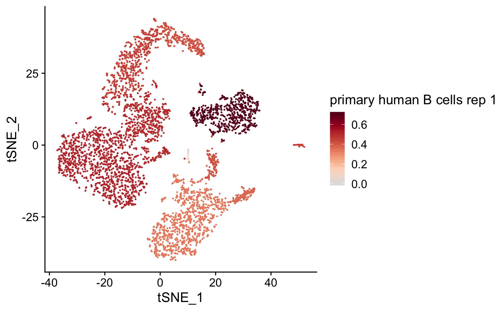
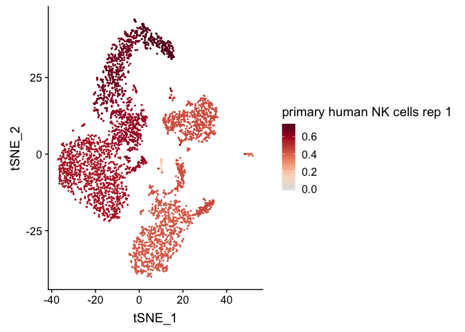
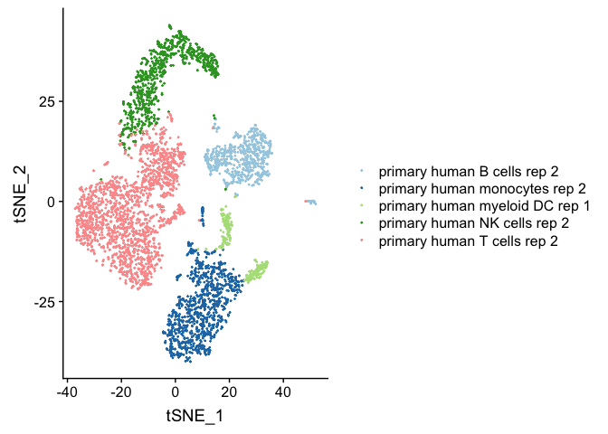

[](https://travis-ci.org/rnabioco/clustifyR)
[](https://ci.appveyor.com/project/rnabioco/clustifyR)
[](https://codecov.io/github/rnabioco/clustifyR?branch=master)

# clustifyR 

clustifyR classifies cells and clusters in single-cell RNA sequencing
experiments using reference bulk RNA-seq data sets, gene signatures, or
marker genes.

Single cell transcriptomes are difficult to annotate without extensive
knowledge of the underlying biology of the system in question. Even with
this knowledge, accurate identification can be challenging due to the
lack of detectable expression of common marker genes. ClustifyR solves
this problem by automatically annotating single cells or clusters using
bulk RNA-seq data or marker gene lists. Additional functions allow for
exploratory analysis of similarities between single cell RNA-seq
datasets and reference data.

## Installation

``` r
# install.packages("devtools")
devtools::install_github("rnabioco/clustifyR")
```

## Example usage

In this example we use the following input data:

  - an expression matrix of single cell RNA-seq data (`pbmc4k_matrix`)
  - a metadata data.frame (`pbmc4k_meta`)
  - a vector of variable genes (`pbmc4k_vargenes`)-
  - a matrix of bulk RNA-seq read counts (`pbmc_bulk_matrix`):

We then calculate correlation coefficients and plot them on a
pre-calculated tSNE projection (stored in `pbmc4k_meta`).

``` r
library(clustifyR)

res <- clustify(
  input = pbmc4k_matrix,
  metadata = pbmc4k_meta$cluster,
  bulk_mat = pbmc_bulk_matrix,
  query_genes = pbmc4k_vargenes
)

plot_cor(
  res,
  pbmc4k_meta,
  colnames(res)[c(1, 5)],
  cluster_col = "cluster"
)
#> [[1]]
```



    #> 
    #> [[2]]



``` r

plot_best_call(res, pbmc4k_meta)
```



Alternatively, `clustify` can take a clustered `seurat` object and
assign identities.

``` r
res <- clustify(
  input = s_object,
  cluster_col = "cluster.ids"
  bulk_mat = pbmc_bulk_matrix,
  seurat_out = T
)
```
