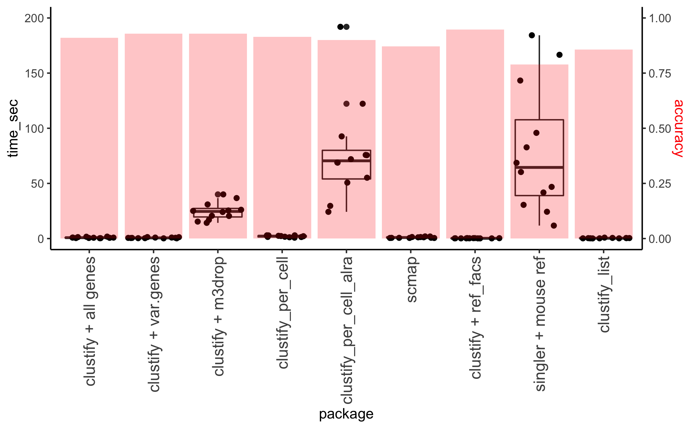

```{r knitr_opts, echo = FALSE, message = FALSE, warning = FALSE}
knitr::opts_chunk$set(
  message = FALSE,
  warning = FALSE,
  collapse = TRUE,
  comment = "#>",
  fig.align = "center"
)
```

## Benchmark 1. MCA lung dataset annotation using `ref_tabula_muris_drop` reference

```{r library, include = FALSE, eval = FALSE}
library(Seurat)
library(clustifyr)
library(tidyverse)

l1 <- read_delim("/Users/rf/Downloads/rmbatch_dge/Lung1_rm.batch_dge.txt.gz", delim = " ")
l1 <- read_delim("/Users/rf/Downloads/rmbatch_dge/Lung1_rm.batch_dge.txt.gz", delim = " ", col_names = c("id",colnames(l1)), skip = 1)

l2 <- read_delim("/Users/rf/Downloads/rmbatch_dge/Lung2_rm.batch_dge.txt.gz", delim = " ")
l2 <- read_delim("/Users/rf/Downloads/rmbatch_dge/Lung2_rm.batch_dge.txt.gz", delim = " ", col_names = c("id",colnames(l2)), skip = 1)

l3 <- read_delim("/Users/rf/Downloads/rmbatch_dge/Lung3_rm.batch_dge.txt.gz", delim = " ")
l3 <- read_delim("/Users/rf/Downloads/rmbatch_dge/Lung3_rm.batch_dge.txt.gz", delim = " ", col_names = c("id",colnames(l3)), skip = 1)

genes <- intersect(intersect(l1$id, l2$id), l3$id)

l1m <- l1 %>% column_to_rownames("id")
l2m <- l2 %>% column_to_rownames("id")
l3m <- l3 %>% column_to_rownames("id")

l1n <- l1m[genes,]
l2n <- l2m[genes,]
l3n <- l3m[genes,]

l <- cbind(l1n,l2n) %>% cbind(l3n)
l <- t(l) %>% as.matrix()

m <- read_csv("/Users/rf/Downloads/MCA_CellAssignments.csv")
m %>% filter(Cell.name %in% rownames(l)) -> l_meta
l_meta %>% column_to_rownames("Cell.name") -> l_meta
saveRDS(l_meta, "MCA_lung_meta")

l <- l[l_meta$Cell.name,]
saveRDS(l, "MCA_lung_mat")
```

```{r load, message=FALSE, warning=FALSE}
library(tidyverse)
library(clustifyr)
library(clustifyrdata)

l_mat <- clustifyrdata::MCA_lung_mat
l_meta <- clustifyrdata::MCA_lung_meta

# find lung references, remove generic terms
lung_cols <- colnames(ref_tabula_muris_drop) %>%
  grep("-Lung", ., value = TRUE)

tml_ref <- ref_tabula_muris_drop[, lung_cols]
tml_ref <- tml_ref[, -c(8,13)]


# default with all genes
start <- proc.time()

res <- clustify(
  input = l_mat, 
  ref_mat = tml_ref, 
  metadata = l_meta, 
  cluster_col = "Annotation"
)

res_allgenes <- cor_to_call(
  cor_mat = res, 
  metadata = l_meta, 
  cluster_col = "Annotation"
)

end <- proc.time()
names(res_allgenes) <- c("MCA annotation", "clustifyr call", "r")

print(end - start)
print(res_allgenes, n = nrow(res_allgenes))
```

## benchmark 2. Using sorted microarray data to classify 10x PBMC example data, available in `clustifyrdata` package

```{r micro}
full_pbmc_matrix <- clustifyrdata::pbmc_matrix
full_pbmc_meta <- clustifyrdata::pbmc_meta
microarray_ref <- clustifyrdata::hema_microarray_matrix

start <- proc.time()

res <- clustify(
  input = full_pbmc_matrix, 
  ref_mat = microarray_ref, 
  metadata = full_pbmc_meta, 
  query_genes = pbmc_vargenes[1:500],
  cluster_col = "classified"
)

res2 <- cor_to_call(res, threshold = 0.5)

end <- proc.time()
names(res2) <- c("manual annotation", "clustifyr call", "r")

print(end - start)

print(res2, n = nrow(res2))
```
## Comparison with other methods
using Tablua Muris (drop and facs samples) 12 shared tissues, which can be downloaded as `seurat` objects

1. Building reference and then mapping:

default `clustify`, with all genes

`clustify`, pulling `var.genes` from `seurat` objects

`clustify`, using `M3Drop` for feature selection

`clustify`, using `per_cell = TRUE` option, and then assign cluster consensus ident with `collapse_to_cluster = TRUE`

`clustify`, after `ALRA` imputation, using `per_cell = TRUE` option, and then assign cluster consensus ident with `collapse_to_cluster = TRUE`

`scmap-cluster`

2. Mapping from prebuilt all-encompassing references to the drop samples:

`clustify`, using `ref_tabula_muris_facs`

`singleR`, using default built-in mouse references without fine tuning

3. Generate marker gene list (of 30 genes per reference identity), and then mapping

default `clustify_list`



```{r tab, include = F, eval=F}
library(clustifyr)
library(tidyverse)

files_facs <- list.files(path = "/Users/rf/", pattern = "facs.*\\.Robj$")
files_drop <- list.files(path = "/Users/rf/", pattern = "droplet.*\\.Robj$")

tissue_facs <- str_extract(files_facs, "facs_.+?_") %>% str_sub(6, -2)
tissue_drop <- str_extract(files_drop, "droplet_.+?_") %>% str_sub(9, -2)
tissue_both <- intersect(tissue_drop, tissue_facs)
files_facs_fil <- files_facs[tissue_facs %in% tissue_drop]
files_drop_fil <- files_drop[tissue_drop %in% tissue_facs]

load_obj <- function(f) {
  env <- new.env()
  nm <- load(f, env)[1]
  env[[nm]]
  }
```

```{r ref, include = FALSE, eval = FALSE}
for (n in 1:length(files_drop_fil)) {
  print(files_drop_fil[n])
  s <- load_obj(paste0("/Users/rf/", files_drop_fil[n]))
  #avg <- use_seurat_comp(s, cluster_col = "cell_ontology_class")
  if (sum(is.na(s@meta.data$free_annotation)) > nrow(s@meta.data)) {
    avg <- use_seurat_comp(s, cluster_col = "free_annotation")
  } else {
    avg <- use_seurat_comp(s, cluster_col = "cell_ontology_class")
  }  #avg <- cbind(avg, avg2)
  colnames(avg) <- str_c(colnames(avg), str_sub(str_extract(files_drop_fil[n], "_.+?_"), 2, -2), sep = "-")
  if (n==1) {
    ref <- avg
  } else {
    ref <- cbind(ref, avg)
  }
}

saveRDS(ref, "tabula_muris_ref_drop_042119.rds")

for (n in 1:length(files_facs_fil)) {
  print(files_facs_fil[n])
  s <- load_obj(paste0("/Users/rf/", files_facs_fil[n]))
  #avg <- use_seurat_comp(s, cluster_col = "cell_ontology_class")
  if (sum(is.na(s@meta.data$free_annotation)) > nrow(s@meta.data)) {
    avg <- use_seurat_comp(s, cluster_col = "free_annotation")
  } else {
    avg <- use_seurat_comp(s, cluster_col = "cell_ontology_class")
  }
  #avg <- cbind(avg, avg2)
  colnames(avg) <- str_c(colnames(avg), str_sub(str_extract(files_facs_fil[n], "_.+?_"), 2, -2), sep = "-")
  if (n==1) {
    ref <- avg
  } else {
    ref <- cbind(ref, avg)
  }
}

saveRDS(ref, "tabula_muris_ref_facs_042119.rds")
```

```{r test, include = FALSE, eval = FALSE}
# ref <- readRDS("tabula_muris_ref_drop_042119.rds")
times <- list()
for (n in 1:length(tissue_both)) {
  print(tissue_both[n])
  s_d <- load_obj(paste0("/Users/rf/", files_facs_fil[n]))
  s_f <- load_obj(paste0("/Users/rf/", files_drop_fil[n]))

  start <- proc.time()
  if (sum(is.na(s_f@meta.data$free_annotation)) + sum(is.na(s_d@meta.data$free_annotation)) < (nrow(s_f@meta.data) + nrow(s_d@meta.data)) * 0.25) {
    print("use free_annotation")
    if (length(unique(s_f@meta.data$free_annotation)) < length(unique(s_d@meta.data$free_annotation))) {
      s_temp <- s_d
      s_d <- s_f
      s_f <- s_temp
      print("switch")
    }
    avg <- use_seurat_comp(s_f, cluster_col = "free_annotation")
    res <- clustify(s_d, avg, seurat_out = FALSE, cluster_col = "free_annotation")
  } else {
    print("use cell_ontology_class")
    if (length(unique(s_f@meta.data$cell_ontology_class)) < length(unique(s_d@meta.data$cell_ontology_class))) {
      s_temp <- s_d
      s_d <- s_f
      s_f <- s_temp
      print("switch")
    }
    avg <- use_seurat_comp(s_f, cluster_col = "cell_ontology_class")
    res <- clustify(s_d, avg, seurat_out = FALSE, cluster_col = "cell_ontology_class")
  }  #avg <- cbind(avg, avg2)
  res2 <- cor_to_call(res) %>% mutate(call = ifelse(cluster == type, 1, 0))
  end <- proc.time()
  times[n] = end - start
  res2$tissue <- tissue_both[n]
  if (n==1) {
    resall <- res2
  } else {
    resall <- rbind(resall, res2)
  }
}

resall2 <- resall %>% filter(cluster != "unknown")
#resall2neg <- resall2 %>% filter(call == 0)
# keep <- c(1,2,4,5,8,9,10,12,13,15,16,17,18,19,20, 21,23)
# resall2negcor <- resall2neg[keep,]
# resall2 <- resall2 %>% mutate(finalcall = ifelse(call == 1, 1, ifelse(str_c(cluster, type) %in% str_c(resall2negcor_all$cluster, resall2negcor_all$type), 1, 0)))
# mean(resall2$finalcall) # 92.86%
# 
# resall2negcor_all
# saveRDS(resall2, "clustify_resall2")
```

```{r m3drop, include = FALSE, eval = FALSE}
# ref <- readRDS("tabula_muris_ref_drop_042119.rds")
library(M3Drop)
times3 <- list()
for (n in 1:length(tissue_both)) {
  print(tissue_both[n])
  s_d <- load_obj(paste0("/Users/rf/", files_facs_fil[n]))
  s_f <- load_obj(paste0("/Users/rf/", files_drop_fil[n]))

  start <- proc.time()
  if (sum(is.na(s_f@meta.data$free_annotation)) < nrow(s_f@meta.data)/2) {
    print("use free_annotation")
    if (length(unique(s_f@meta.data$free_annotation)) < length(unique(s_d@meta.data$free_annotation))) {
      s_temp <- s_d
      s_d <- s_f
      s_f <- s_temp
      print("switch")
    }
    avg <- use_seurat_comp(s_f, cluster_col = "free_annotation")
    
    tm <- expm1(as.matrix(s_d@data))
    Normalized_data <- M3DropCleanData(tm,
                                    labels = rownames(s_d@data),
                                    is.counts=FALSE)
    fits <- M3DropDropoutModels(Normalized_data$data)
    DE_genes <- M3DropDifferentialExpression(Normalized_data$data,
                                          mt_method="fdr", mt_threshold=0.01)
    
    res <- clustify(s_d, avg, seurat_out = FALSE, cluster_col = "free_annotation", query_genes = DE_genes$Gene)
  } else {
    print("use cell_ontology_class")
    if (length(unique(s_f@meta.data$cell_ontology_class)) < length(unique(s_d@meta.data$cell_ontology_class))) {
      s_temp <- s_d
      s_d <- s_f
      s_f <- s_temp
      print("switch")
    }
    
    tm <- expm1(as.matrix(s_d@data))
    Normalized_data <- M3DropCleanData(tm,
                                    labels = rownames(s_d@data),
                                    is.counts=FALSE)
    fits <- M3DropDropoutModels(Normalized_data$data)
    DE_genes <- M3DropDifferentialExpression(Normalized_data$data,
                                          mt_method="fdr", mt_threshold=0.01)
    
    avg <- use_seurat_comp(s_f, cluster_col = "cell_ontology_class")
    res <- clustify(s_d, avg, seurat_out = FALSE, cluster_col = "cell_ontology_class", query_genes = DE_genes$Gene)
  }  #avg <- cbind(avg, avg2)
  res2 <- cor_to_call(res) %>% mutate(call = ifelse(cluster == type, 1, 0))
  end <- proc.time()
  times3[n] = end - start
  
  res2$tissue <- tissue_both[n]
  if (n==1) {
    resall <- res2
  } else {
    resall <- rbind(resall, res2)
  }
}

resall2 <- resall %>% filter(cluster != "unknown")
# resall2neg <- resall2 %>% filter(call == 0)
# keep2 <- c(1,3,5,6,7,9,11,12,13, 15,16,17,18,19,20,21,23)
# resall2negcor2 <- resall2neg[keep2,]

#resall2negcor_all <- rbind(resall2negcor,resall2negcor2) %>% distinct(type, cluster, .keep_all = TRUE)

resall2 <- resall2 %>% mutate(finalcall = ifelse(call == 1, 1, ifelse(str_c(cluster, type) %in% str_c(resall2negcor_all$cluster, resall2negcor_all$type), 1, 0)))
mean(resall2$finalcall) # 92.54% with mt_threshold 0.01 or 0.001, no difference

# saveRDS(resall2negcor_all, "resall2negcor_all") # no early-pro B in reference
```

```{r allgenes, include = FALSE, eval = FALSE}
# ref <- readRDS("tabula_muris_ref_drop_042119.rds")

for (n in 1:length(tissue_both)) {
  print(tissue_both[n])
  s_d <- load_obj(paste0("/Users/rf/", files_facs_fil[n]))
  s_f <- load_obj(paste0("/Users/rf/", files_drop_fil[n]))

  start <- proc.time()
  if (sum(is.na(s_f@meta.data$free_annotation)) < nrow(s_f@meta.data)/2) {
    print("use free_annotation")
    if (length(unique(s_f@meta.data$free_annotation)) < length(unique(s_d@meta.data$free_annotation))) {
      s_temp <- s_d
      s_d <- s_f
      s_f <- s_temp
      print("switch")
    }
    avg <- use_seurat_comp(s_f, cluster_col = "free_annotation")
    res <- clustify(s_d, avg, seurat_out = FALSE, cluster_col = "free_annotation", query_genes = rownames(s_d@data))
  } else {
    print("use cell_ontology_class")
    if (length(unique(s_f@meta.data$cell_ontology_class)) < length(unique(s_d@meta.data$cell_ontology_class))) {
      s_temp <- s_d
      s_d <- s_f
      s_f <- s_temp
      print("switch")
    }
    avg <- use_seurat_comp(s_f, cluster_col = "cell_ontology_class")
    res <- clustify(s_d, avg, seurat_out = FALSE, cluster_col = "cell_ontology_class", query_genes = rownames(s_d@data))
  }  #avg <- cbind(avg, avg2)
  res2 <- cor_to_call(res) %>% mutate(call = ifelse(cluster == type, 1, 0))
  end <- proc.time()
  times3[n] = end - start
  res2$tissue <- tissue_both[n]
  if (n==1) {
    resall <- res2
  } else {
    resall <- rbind(resall, res2)
  }
}

resall2 <- resall %>% filter(cluster != "unknown")
resall2neg <- resall2 %>% filter(call == 0)
# keep <- c(1,2,4,5,8,9,10,12,13,15,16,17,18,19,20, 21,23)
# resall2negcor <- resall2neg[keep,]
resall2 <- resall2 %>% mutate(finalcall = ifelse(call == 1, 1, ifelse(str_c(cluster, type) %in% str_c(resall2negcor_all$cluster, resall2negcor_all$type), 1, 0)))
mean(resall2$finalcall) # 91.04 %
```

```{r test_single, include = FALSE, eval = FALSE}
times <- list()
for (n in 1:length(tissue_both)) {
  print(tissue_both[n])
  s_d <- load_obj(paste0("/Users/rf/", files_facs_fil[n]))
  s_f <- load_obj(paste0("/Users/rf/", files_drop_fil[n]))

  start <- proc.time()
  if (sum(is.na(s_f@meta.data$free_annotation)) + sum(is.na(s_d@meta.data$free_annotation)) < (nrow(s_f@meta.data) + nrow(s_d@meta.data)) * 0.25) {
    print("use free_annotation")
    if (length(unique(s_f@meta.data$free_annotation)) < length(unique(s_d@meta.data$free_annotation))) {
      s_temp <- s_d
      s_d <- s_f
      s_f <- s_temp
      print("switch")
    }
    ids <- s_d@meta.data[["free_annotation"]]
    avg <- use_seurat_comp(s_f, cluster_col = "free_annotation")
    res <- clustify(s_d, avg, seurat_out = FALSE, cluster_col = "free_annotation", per_cell = TRUE)
    res2 <- cor_to_call(res, metadata = s_d@meta.data %>% rownames_to_column("id"), cluster_col = "id", collapse_to_cluster = "free_annotation") %>% distinct(type, type2)
  } else {
    print("use cell_ontology_class")
    if (length(unique(s_f@meta.data$cell_ontology_class)) < length(unique(s_d@meta.data$cell_ontology_class))) {
      s_temp <- s_d
      s_d <- s_f
      s_f <- s_temp
      print("switch")
    }
    ids <- s_d@meta.data[["cell_ontology_class"]]
    avg <- use_seurat_comp(s_f, cluster_col = "cell_ontology_class")
    res <- clustify(s_d, avg, seurat_out = FALSE, cluster_col = "cell_ontology_class", per_cell = TRUE)
    res2 <- cor_to_call(res, metadata = s_d@meta.data %>% rownames_to_column("id"), cluster_col = "id", collapse_to_cluster = "cell_ontology_class") %>% distinct(type, type2)
  }
  colnames(res2) <- c("cluster", "type")
  res2 <- res2 %>% group_by_all() %>% tally() %>% mutate(call = ifelse(cluster == type, 1, 0))
  
  end <- proc.time()
  times[n] = end - start
  res2$tissue <- tissue_both[n]
  if (n==1) {
    resall <- res2
  } else {
    resall <- rbind(resall, res2)
  }
}

resall2 <- resall %>% filter(cluster != "unknown")
#resall2neg <- resall2 %>% filter(call == 0)
# keep <- c(1,2,4,5,8,9,10,12,13,15,16,17,18,19,20, 21,23)
# resall2negcor <- resall2neg[keep,]
saveRDS(resall2negcor_all, "resall2negcor_all")
resall2negcor_all <- readRDS("resall2negcor_all")
resall2 <- resall2 %>% mutate(finalcall = ifelse(call == 1, 1, ifelse(str_c(cluster, type) %in% str_c(resall2negcor_all$cluster, resall2negcor_all$type), 1, 0))) %>% replace_na(list(finalcall = 0))
resall2
mean(resall2$finalcall) # 0.914 %
# 
# resall2negcor_all
saveRDS(resall2, "clustify_cell_resall2")
resall2 <- readRDS("clustify_cell_resall2")

saveRDS(times, "clustify_cell_times")
```

```{r test_single_rm0, include = FALSE, eval = FALSE}
times <- list()
for (n in 1:length(tissue_both)) {
  print(tissue_both[n])
  s_d <- load_obj(paste0("/Users/rf/", files_facs_fil[n]))
  s_f <- load_obj(paste0("/Users/rf/", files_drop_fil[n]))

  start <- proc.time()
  if (sum(is.na(s_f@meta.data$free_annotation)) + sum(is.na(s_d@meta.data$free_annotation)) < (nrow(s_f@meta.data) + nrow(s_d@meta.data)) * 0.25) {
    print("use free_annotation")
    if (length(unique(s_f@meta.data$free_annotation)) < length(unique(s_d@meta.data$free_annotation))) {
      s_temp <- s_d
      s_d <- s_f
      s_f <- s_temp
      print("switch")
    }
    ids <- s_d@meta.data[["free_annotation"]]
    avg <- use_seurat_comp(s_f, cluster_col = "free_annotation")
    res <- clustify(s_d, avg, seurat_out = FALSE, cluster_col = "free_annotation", per_cell = TRUE, rm0 = TRUE)
    res2 <- cor_to_call(res, metadata = s_d@meta.data %>% rownames_to_column("id"), cluster_col = "id", collapse_to_cluster = "free_annotation") %>% distinct(type, type2)
  } else {
    print("use cell_ontology_class")
    if (length(unique(s_f@meta.data$cell_ontology_class)) < length(unique(s_d@meta.data$cell_ontology_class))) {
      s_temp <- s_d
      s_d <- s_f
      s_f <- s_temp
      print("switch")
    }
    ids <- s_d@meta.data[["cell_ontology_class"]]
    avg <- use_seurat_comp(s_f, cluster_col = "cell_ontology_class")
    res <- clustify(s_d, avg, seurat_out = FALSE, cluster_col = "cell_ontology_class", per_cell = TRUE, rm0 = TRUE)
    res2 <- cor_to_call(res, metadata = s_d@meta.data %>% rownames_to_column("id"), cluster_col = "id", collapse_to_cluster = "cell_ontology_class") %>% distinct(type, type2)
  }
  colnames(res2) <- c("cluster", "type")
  res2 <- res2 %>% group_by_all() %>% tally() %>% mutate(call = ifelse(cluster == type, 1, 0))
  
  end <- proc.time()
  times[n] = end - start
  res2$tissue <- tissue_both[n]
  if (n==1) {
    resall <- res2
  } else {
    resall <- rbind(resall, res2)
  }
}

resall2 <- resall %>% filter(cluster != "unknown")
#resall2neg <- resall2 %>% filter(call == 0)
# keep <- c(1,2,4,5,8,9,10,12,13,15,16,17,18,19,20, 21,23)
# resall2negcor <- resall2neg[keep,]
resall2negcor_all <- readRDS("resall2negcor_all")

saveRDS(resall2negcor_all, "resall2negcor_all")
resall2negcor_all <- readRDS("resall2negcor_all")
resall2 <- resall2 %>% mutate(finalcall = ifelse(call == 1, 1, ifelse(str_c(cluster, type) %in% str_c(resall2negcor_all$cluster, resall2negcor_all$type), 1, 0))) %>% replace_na(list(finalcall = 0)) %>% filter(!is.na(type))
resall2
mean(resall2$finalcall) # 0.857 %
# 
# resall2negcor_all
saveRDS(resall2, "clustify_cell_resall_rm0")
resall2 <- readRDS("clustify_cell_resall_rm0")
a <- readRDS("clustify_cell_resall2")
saveRDS(times, "clustify_cell_time_rm0s")
```

```{r test_single_alra, include = FALSE, eval = FALSE}
source("/Users/rf/git_libs/ALRA/alra.R")
source("/Users/rf/git_libs/ALRA/alraSeurat2.R")
library(Matrix)
times <- list()
for (n in 1:length(tissue_both)) {
  print(tissue_both[n])
  s_d <- load_obj(paste0("/Users/rf/", files_facs_fil[n]))
  s_f <- load_obj(paste0("/Users/rf/", files_drop_fil[n]))

  start <- proc.time()
  if (sum(is.na(s_f@meta.data$free_annotation)) + sum(is.na(s_d@meta.data$free_annotation)) < (nrow(s_f@meta.data) + nrow(s_d@meta.data)) * 0.25) {
    print("use free_annotation")
    if (length(unique(s_f@meta.data$free_annotation)) < length(unique(s_d@meta.data$free_annotation))) {
      s_temp <- s_d
      s_d <- s_f
      s_f <- s_temp
      print("switch")
    }
    ids <- s_d@meta.data[["free_annotation"]]
    avg <- use_seurat_comp(s_f, cluster_col = "free_annotation")
    s_d <- alraSeurat2(s_d)
    res <- clustify(s_d, avg, seurat_out = FALSE, cluster_col = "free_annotation", per_cell = TRUE)
    res2 <- cor_to_call(res, metadata = s_d@meta.data %>% rownames_to_column("id"), cluster_col = "id", collapse_to_cluster = "free_annotation") %>% distinct(type, type2)
  } else {
    print("use cell_ontology_class")
    if (length(unique(s_f@meta.data$cell_ontology_class)) < length(unique(s_d@meta.data$cell_ontology_class))) {
      s_temp <- s_d
      s_d <- s_f
      s_f <- s_temp
      print("switch")
    }
    ids <- s_d@meta.data[["cell_ontology_class"]]
    avg <- use_seurat_comp(s_f, cluster_col = "cell_ontology_class")
    s_d <- alraSeurat2(s_d)
    res <- clustify(s_d, avg, seurat_out = FALSE, cluster_col = "cell_ontology_class", per_cell = TRUE)
    res2 <- cor_to_call(res, metadata = s_d@meta.data %>% rownames_to_column("id"), cluster_col = "id", collapse_to_cluster = "cell_ontology_class") %>% distinct(type, type2)
  }
  colnames(res2) <- c("cluster", "type")
  res2 <- res2 %>% group_by_all() %>% tally() %>% mutate(call = ifelse(cluster == type, 1, 0))
  
  end <- proc.time()
  times[n] = end - start
  res2$tissue <- tissue_both[n]
  if (n==1) {
    resall <- res2
  } else {
    resall <- rbind(resall, res2)
  }
}

resall2 <- resall %>% filter(cluster != "unknown")
#resall2neg <- resall2 %>% filter(call == 0)
# keep <- c(1,2,4,5,8,9,10,12,13,15,16,17,18,19,20, 21,23)
# resall2negcor <- resall2neg[keep,]
resall2negcor_all <- readRDS("resall2negcor_all")

saveRDS(resall2negcor_all, "resall2negcor_all")
resall2negcor_all <- readRDS("resall2negcor_all")
resall2 <- resall2 %>% mutate(finalcall = ifelse(call == 1, 1, ifelse(str_c(cluster, type) %in% str_c(resall2negcor_all$cluster, resall2negcor_all$type), 1, 0))) %>% replace_na(list(finalcall = 0)) %>% filter(!is.na(type))
resall2
mean(resall2$finalcall) # 0.9 %
# 
# resall2negcor_all
saveRDS(resall2, "clustify_cell_resall_alra")
a <- readRDS("clustify_cell_resall2")
saveRDS(times, "clustify_cell_times_alra")
```

```{r test_all, include = FALSE, eval = FALSE}
# ref <- readRDS("tabula_muris_ref_drop_042119.rds")
ref_facs <- readRDS("/Users/rf/cluster/devel/3rd/clustifyr/tabula_muris_ref_facs.rds")
times <- list()
for (n in 1:length(tissue_both)) {
  print(tissue_both[n])
  s_f <- load_obj(paste0("/Users/rf/", files_drop_fil[n]))

  start <- proc.time()
  if (sum(is.na(s_f@meta.data$free_annotation)) + sum(is.na(s_d@meta.data$free_annotation)) < (nrow(s_f@meta.data) + nrow(s_d@meta.data)) * 0.25) {
    print("use free_annotation")
    res <- clustify(s_f, ref_facs, seurat_out = FALSE, cluster_col = "free_annotation")
  } else {
    print("use cell_ontology_class")
    res <- clustify(s_f, ref_facs, seurat_out = FALSE, cluster_col = "cell_ontology_class")
  } 
  res2 <- cor_to_call(res) %>% mutate(call = ifelse(cluster == type, 1, 0))
  end <- proc.time()
  times[n] = end - start
  res2$tissue <- tissue_both[n]
  if (n==1) {
    resall <- res2
  } else {
    resall <- rbind(resall, res2)
  }
}

rescomp <- resall %>% filter(cluster!="unknown") %>% select(cluster, type) %>% ungroup() %>%  cbind(resall2)
```

```{r load2, include = FALSE, eval = FALSE}
library(here)
library(clustifyr)
library(tidyverse)

l_mat <- readRDS(here("MCA_lung_mat"))
l_meta <- readRDS(here("MCA_lung_meta"))
load(here("data","ref_tabula_muris_facs.rda"))
tml_ref <- ref_tabula_muris_facs[,colnames(ref_tabula_muris_facs)[str_detect(colnames(ref_tabula_muris_facs),"-Lung")][-c(4,8)]] # find lung references, remove generic terms
ref_facs <- readRDS("/Users/rf/cluster/devel/3rd/clustifyr/tabula_muris_ref_facs.rds")


library("M3Drop")
tm <- expm1(as.matrix(l_mat))
Normalized_data <- M3DropCleanData(tm,
                                    labels = rownames(l_mat),
                                    is.counts=FALSE)
dim(Normalized_data$data)
fits <- M3DropDropoutModels(Normalized_data$data)
DE_genes <- M3DropDifferentialExpression(Normalized_data$data,
                                          mt_method="fdr", mt_threshold=0.1)

# default with all genes
start <- proc.time()
res <- clustify(l_mat, 
                ref_facs, 
                l_meta, 
                cluster_col = "Annotation",
                query_genes = DE_genes$Gene)

res_allgenes <- cor_to_call(res, 
                            l_meta, 
                            cluster_col = "Annotation")
end <- proc.time()
names(res_allgenes) <- c("MCA annotation", "clustifyr call", "r")

print(end - start)

print(res_allgenes, n = nrow(res_allgenes))
```

```{r test_cluster, include = FALSE, eval = FALSE}
# ref <- readRDS("tabula_muris_ref_drop_042119.rds")
times <- list()
for (n in 1:length(tissue_both)) {
  print(tissue_both[n])
  s_d <- load_obj(paste0("/Users/rf/", files_facs_fil[n]))
  s_f <- load_obj(paste0("/Users/rf/", files_drop_fil[n]))

  start <- proc.time()
  if (sum(is.na(s_f@meta.data$free_annotation)) + sum(is.na(s_d@meta.data$free_annotation)) < (nrow(s_f@meta.data) + nrow(s_d@meta.data)) * 0.25) {
    print("use free_annotation")
    if (length(unique(s_f@meta.data$free_annotation)) < length(unique(s_d@meta.data$free_annotation))) {
      s_temp <- s_d
      s_d <- s_f
      s_f <- s_temp
      print("switch")
    }
    avg <- use_seurat_comp(s_f, cluster_col = "free_annotation")
    res <- clustify(s_d, avg, seurat_out = FALSE, cluster_col = "cluster.ids")
    temp <- s_d@meta.data %>% distinct(cluster.ids, free_annotation)
    colnames(temp) <- c("cluster","old")
  } else {
    print("use cell_ontology_class")
    if (length(unique(s_f@meta.data$cell_ontology_class)) < length(unique(s_d@meta.data$cell_ontology_class))) {
      s_temp <- s_d
      s_d <- s_f
      s_f <- s_temp
      print("switch")
    }
    avg <- use_seurat_comp(s_f, cluster_col = "cell_ontology_class")
    res <- clustify(s_d, avg, seurat_out = FALSE, cluster_col = "cluster.ids")
    temp <- s_d@meta.data %>% distinct(cluster.ids, cell_ontology_class)
    colnames(temp) <- c("cluster","old")
  }
  res2 <- cor_to_call(res) %>% mutate(call = ifelse(cluster == type, 1, 0))
  end <- proc.time()
  times[n] = end - start
  res2$tissue <- tissue_both[n]
  res2 <- left_join(temp, res2)
  
  if (n==1) {
    resall <- res2
  } else {
    resall <- rbind(resall, res2)
  }
}

resall2negcor_all <- readRDS("/Users/rf/cluster/devel/3rd/clustifyr/resall2negcor_all")
resall2 <- resall %>% filter(!is.na(old)) %>% mutate(call = ifelse(old == type, 1, 0)) %>% mutate(finalcall = ifelse(call == 1, 1, ifelse(str_c(old, type) %in% str_c(resall2negcor_all$cluster, resall2negcor_all$type), 1, 0)))
mean(resall2$finalcall) # 91.41 %
#resall2neg <- resall2 %>% filter(call == 0)
# keep <- c(1,2,4,5,8,9,10,12,13,15,16,17,18,19,20, 21,23)
# resall2negcor <- resall2neg[keep,]
# resall2 <- resall2 %>% mutate(finalcall = ifelse(call == 1, 1, ifelse(str_c(cluster, type) %in% str_c(resall2negcor_all$cluster, resall2negcor_all$type), 1, 0)))
# mean(resall2$finalcall) # 92.86%
# 
# resall2negcor_all
# saveRDS(resall2, "clustify_resall2")
```

```{r test_cluster_singlerREF, include = FALSE, eval = FALSE}
# ref <- readRDS("tabula_muris_ref_drop_042119.rds")
average_clusters(SingleR::mouse.rnaseq$data, SingleR::mouse.rnaseq$types, log_scale = FALSE) -> mouse_ref
average_clusters(scmap::yan, scmap::ann$cell_type1, log_scale = FALSE) -> yan_ref

clustify(scmap::yan, yan_ref, scmap::ann, cluster_col = "cell_type1", per_cell = TRUE) %>% cor_to_call() %>% left_join(scmap::ann %>% rownames_to_column("cluster")) ->res


times <- list()
for (n in 1:length(tissue_both)) {
  print(tissue_both[n])
  s_d <- load_obj(paste0("/Users/rf/", files_facs_fil[n]))
  s_f <- load_obj(paste0("/Users/rf/", files_drop_fil[n]))

  start <- proc.time()
  if (sum(is.na(s_f@meta.data$free_annotation)) + sum(is.na(s_d@meta.data$free_annotation)) < (nrow(s_f@meta.data) + nrow(s_d@meta.data)) * 0.25) {
    print("use free_annotation")
    if (length(unique(s_f@meta.data$free_annotation)) < length(unique(s_d@meta.data$free_annotation))) {
      s_temp <- s_d
      s_d <- s_f
      s_f <- s_temp
      print("switch")
    }
    res <- clustify(s_d, mouse_ref, seurat_out = FALSE, cluster_col = "cluster.ids")
    temp <- s_d@meta.data %>% distinct(cluster.ids, free_annotation)
    colnames(temp) <- c("cluster","old")
  } else {
    print("use cell_ontology_class")
    if (length(unique(s_f@meta.data$cell_ontology_class)) < length(unique(s_d@meta.data$cell_ontology_class))) {
      s_temp <- s_d
      s_d <- s_f
      s_f <- s_temp
      print("switch")
    }
    res <- clustify(s_d, mouse_ref, seurat_out = FALSE, cluster_col = "cluster.ids")
    temp <- s_d@meta.data %>% distinct(cluster.ids, cell_ontology_class)
    colnames(temp) <- c("cluster","old")
  }
  res2 <- cor_to_call(res) %>% mutate(call = ifelse(cluster == type, 1, 0))
  end <- proc.time()
  times[n] = end - start
  res2$tissue <- tissue_both[n]
  res2 <- left_join(temp, res2)
  
  if (n==1) {
    resall <- res2
  } else {
    resall <- rbind(resall, res2)
  }
}

resall2negcor_all <- readRDS("/Users/rf/cluster/devel/3rd/clustifyr/resall2negcor_all")
resall2 <- resall %>% filter(!is.na(old)) %>% mutate(call = ifelse(old == type, 1, 0)) %>% mutate(finalcall = ifelse(call == 1, 1, ifelse(str_c(old, type) %in% str_c(resall2negcor_all$cluster, resall2negcor_all$type), 1, 0)))
mean(resall2$finalcall) # 91.41 %
#resall2neg <- resall2 %>% filter(call == 0)
# keep <- c(1,2,4,5,8,9,10,12,13,15,16,17,18,19,20, 21,23)
# resall2negcor <- resall2neg[keep,]
# resall2 <- resall2 %>% mutate(finalcall = ifelse(call == 1, 1, ifelse(str_c(cluster, type) %in% str_c(resall2negcor_all$cluster, resall2negcor_all$type), 1, 0)))
# mean(resall2$finalcall) # 92.86%
# 
# resall2negcor_all
# saveRDS(resall2, "clustify_resall2")
```

```{r test_sctransform, include = FALSE, eval = FALSE}
sctransform_s2 <- function(s) {
  mat <- sctransform::vst(as(as.matrix(s@raw.data), "dgCMatrix"))$y
  l1 <- colnames(mat)
  l2 <- rownames(s@meta.data)
  l <- intersect(l1, l2)
  meta <- s@meta.data[l,]
  mat <- mat[,l]
  s@data <- mat
  s@meta.data <- meta
  s
}
# ref <- readRDS("tabula_muris_ref_drop_042119.rds")
times <- list()
for (n in 7:length(tissue_both)) {# n = 6 and 12 fails
  print(tissue_both[n])
  s_d <- load_obj(paste0("/Users/rf/", files_facs_fil[n]))
  s_f <- load_obj(paste0("/Users/rf/", files_drop_fil[n]))
  s_d <- sctransform_s2(s_d)
  s_f <- sctransform_s2(s_f)

  start <- proc.time()
  if (sum(is.na(s_f@meta.data$free_annotation)) + sum(is.na(s_d@meta.data$free_annotation)) < (nrow(s_f@meta.data) + nrow(s_d@meta.data)) * 0.25) {
    print("use free_annotation")
    if (length(unique(s_f@meta.data$free_annotation)) < length(unique(s_d@meta.data$free_annotation))) {
      s_temp <- s_d
      s_d <- s_f
      s_f <- s_temp
      print("switch")
    }
    avg <- use_seurat_comp(s_f, cluster_col = "free_annotation")
    res <- clustify(s_d, avg, seurat_out = FALSE, cluster_col = "free_annotation")
  } else {
    print("use cell_ontology_class")
    if (length(unique(s_f@meta.data$cell_ontology_class)) < length(unique(s_d@meta.data$cell_ontology_class))) {
      s_temp <- s_d
      s_d <- s_f
      s_f <- s_temp
      print("switch")
    }
    avg <- use_seurat_comp(s_f, cluster_col = "cell_ontology_class")
    res <- clustify(s_d, avg, seurat_out = FALSE, cluster_col = "cell_ontology_class")
  }  #avg <- cbind(avg, avg2)
  res2 <- cor_to_call(res) %>% mutate(call = ifelse(cluster == type, 1, 0))
  end <- proc.time()
  times[n] = end - start
  res2$tissue <- tissue_both[n]
  if (n==1) {
    resall <- res2
  } else {
    resall <- rbind(resall, res2)
  }
}

saveRDS(resall, "sctransform_resall")
resall2 <- resall %>% filter(cluster != "unknown")
resall2negcor_all <- readRDS("/Users/rf/cluster/devel/3rd/clustifyr/resall2negcor_all")
resall2 <- resall2 %>% filter(!is.na(cluster)) %>% mutate(call = ifelse(cluster == type, 1, 0)) %>% mutate(finalcall = ifelse(call == 1, 1, ifelse(str_c(cluster, type) %in% str_c(resall2negcor_all$cluster, resall2negcor_all$type), 1, 0)))
mean(resall2$finalcall) 
#resall2neg <- resall2 %>% filter(call == 0)
# keep <- c(1,2,4,5,8,9,10,12,13,15,16,17,18,19,20, 21,23)
# resall2negcor <- resall2neg[keep,]
# resall2 <- resall2 %>% mutate(finalcall = ifelse(call == 1, 1, ifelse(str_c(cluster, type) %in% str_c(resall2negcor_all$cluster, resall2negcor_all$type), 1, 0)))
# mean(resall2$finalcall) # 92.86%
# 
# resall2negcor_all
# saveRDS(resall2, "clustify_resall2")
```
