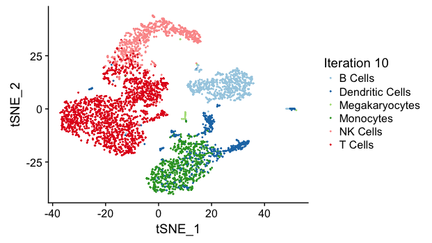

```{r setup, include=FALSE}
knitr::opts_chunk$set(echo = TRUE)
```

## Motivation

Clustering is a crucial step in single cell RNA-seq (scRNA-seq) data analysis. Most popular methods examine the inherent structure of the scRNA-seq dataset, without making use of the biological information of underlying cell types Consequently, optimal determination of the number of clusters and interpretation of each cluster become a challenging problem. Here, we implement the clustering function *refine_clusters*, which accounts for both the proximity of single cell expression levels within a cluster and the estabilished cell type information by comparing the single cell data to the reference bulk RNA-seq data of pre-defined cell types.

## Theory

Let the expression profile of a single cell be $\vec{x\ }$ where each element refers to the expression level (counts/reads) of a gene. Assume the scRNA-seq data is to be clustered into $M$ clusters, and the first $N$ clusters have  reference bulk RNA-seq data of pre-defined cells. Here, we require $M\geq N$. Let $\vec{B_i}$ be the expression profile of the bulk data for $i$-th cluster, and we require $\vec{x\ }$ and $\vec{B_i}$ be organized in the same gene order.

The function *refine_clusters* defines the probability of a cell $\vec{x\ }$ being assigned to cluster $i$ as a weighted product of the probability that $\vec{x\ }$ is similar to $\vec{B_i}$ and the probability that $\vec{x\ }$ is proximal to the centroid of clsuter $i$ (with mean $\vec{\mu_i}$ and standard deviation $\vec{\sigma_i}$). 

The former probability is formulated as
$$P(\vec{x\ }; \vec{B_i}) \propto \exp\{\epsilon S(\vec{x\ }, \vec{B_i})\}$$
where $S(\vec{x\ }, \vec{B_i})$ represents the similarity score between $\vec{x\ }$ and $\vec{B_i}$. One example of similarity score is the correlation computed by *run_cor* function. For clusters without reference data, we assign a default similarity score. $\epsilon$ is a user-defined weighting parameter. 

The latter probability is modeled as a Gaussian distribution, i.e. 
$$P(\vec{x\ }; \vec{\mu_i}, \vec{\sigma_i}) \sim N(\vec{\mu_i}, \mathbf{\Sigma}^{(i)})$$
where the covariance matrix $\mathbf{\Sigma}^{(i)}$ is a diagonal matrix where each element diagonal represents the variance of a gene's expression within the cluster $i$ ($\Sigma^{(i)}_{j,j} = \sigma_{i,j}^2$). 

The overall probability is then expressed as
$$P(\vec{x\ }; \mathrm{Cluster}\ i) = P(\vec{x\ }; \vec{B_i})^\lambda P(\vec{x\ }; \vec{\mu_i}, \vec{\sigma_i})^{1-\lambda}$$
where $\lambda$ is a user-defined input parameter.

For each single cell $\vec{x\ }$, the function *refine_clusters* computes the probability of it being assigned to each cluster, and assigns the cell to the cluster with highest probability. After assigning all single cells, a new clustering is formed and the function repeats the whole process until assignment is converged.

The algorithm works as follows

* Input: scRNA-seq expression matrix, bulk RNA-seq expression matrix, initial cluster assignment
* Output: Optimal cluster assignment

1. For each single cell ($\vec{x\ }$) and each bulk RNA-seq data ($\vec{B_i}$), compute the similarity score $S(\vec{x\ }, \vec{B_i})$. For clusters without reference bulk data, a default similarity score is used.
2. For each cluster $i$, compute its centroid $\vec{\mu_i}$ and $\vec{\sigma_i}$.
3. For each cell ($\vec{x\ }$) and each cluster $i$, compute the probability of assignment $P(\vec{x\ }; \mathrm{Cluster}\ i)$, and assign the cell to the cluster with highest probability.
4. Repeat Step 2-3 until convergence.

## Example
### Dataset

We make use of the **pbmc4k_matrix**, **pbmc4k_meta** and **pbmc_bulk_matrix** dataset. To satisfy the requirement of the function, we define six clusters (Monocytes, B Cells, T Cells, Dendritic Cells, NK Cells and Megakaryocytes) and re-assign each cell to one cluster based on its previous label. We further extract 5 samples (Monocytes, B Cells, T Cells, Dendritic Cells, NK Cells) from the bulk dataset to represent the reference expression profile for the first five clusters. No reference data for Megakaryocytes is provided.

```{preparation}
data("pbmc4k_meta"); data("pbmc4k_matrix"); data("pbmc_bulk_matrix"); data("pbmc4k_markers_M3Drop")

# construct sc_cluster
gene_constraints <- list(rownames(pbmc4k_matrix), rownames(pbmc_bulk_matrix), pbmc4k_markers_M3Drop[,'Gene']);
sc_expr <- select_gene_subset(pbmc4k_matrix, gene_constraints);
bulk_expr <- select_gene_subset(pbmc_bulk_matrix, gene_constraints);
sc_tsne_coord <- pbmc4k_meta[,c('tSNE_1', 'tSNE_2')];
sc_cluster <- rep(0, ncol(sc_expr));
sc_cluster[which(pbmc4k_meta[,'classified']=="CD14+ Monocytes")] <- 1; # 1 monocytes
sc_cluster[which(pbmc4k_meta[,'classified']=="FCGR3A+ Monocytes")] <- 1;
sc_cluster[which(pbmc4k_meta[,'classified']=="B cells")] <- 2; # 2 B cells
sc_cluster[which(pbmc4k_meta[,'classified']=="CD4 T cells, 1")] <- 3; # 3 T cells
sc_cluster[which(pbmc4k_meta[,'classified']=="CD4 T cells, 2")] <- 3;
sc_cluster[which(pbmc4k_meta[,'classified']=="CD8 T cells")] <- 3;
sc_cluster[which(pbmc4k_meta[,'classified']=="Dendritic cells, 1")] <- 4; # 4 DC
sc_cluster[which(pbmc4k_meta[,'classified']=="Dendritic Cells, 2?")] <- 4;
sc_cluster[which(pbmc4k_meta[,'classified']=="NK cells")] <- 5; # 5 NK cells
sc_cluster[which(pbmc4k_meta[,'classified']=="Megakaryocytes")] <- 6; # 6 megakaryocytes (not found)
bulk_expr <- bulk_expr[, c(3, 1, 7, 2, 5)]
colnames(bulk_expr) <- c("Monocytes", "B Cells", "T Cells", "Dendritic Cells", "NK Cells");
cluster_names <- c("Monocytes", "B Cells", "T Cells", "Dendritic Cells", "NK Cells", "Megakaryocytes");
```

### Execution

To demonstrate the power of *refine_clusters*, we randomize the cluster assignment and use the function to re-assign clusters.

```{execution, eval=FALSE}
res <- refine_clusters(sc_expr, sample(sc_cluster, length(sc_cluster)), bulk_expr, lambda=0.5, epsilon=1, if_compute_sigma=TRUE, num_iteration=20, default_similiarity=-1, disagreement_freq=0.01, if_plot=TRUE, tsne_coord=sc_tsne_coord, cluster_names=cluster_names, compute_method=corr_coef);
```

For this execution, we put equal weights on the two probabilities and we allow the algorithm to run at most 20 iterations. Clustering is considered converged if less than 1% of cells are assigned with new labels during one iteration.

To evaluate the performance of the algorithm, we visualize the clusters on the t-SNE plot. As a reference, the ground truth is 


Before clustering, since assignment is randomized, the clusters are well-mixed on the t-SNE plot.


The function shows rapid convergence after 1 iteration,


and clustering is stabilized after 10 iterations.



